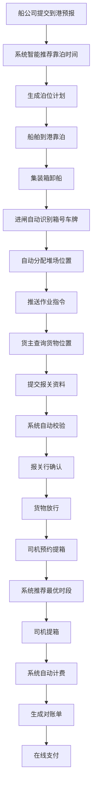

# 智慧港口与集装箱管理系统 - 产品需求文档 (PRD)

## 1. 产品概述
本系统是一个大型综合智慧港口与集装箱管理平台，集成船舶调度、集装箱管理、货主服务、司机预约、费用结算、异常处理、会员体系和运营分析于一体，实现港口运营全流程数字化、智能化管理。
- 解决港口传统作业效率低下、信息不对称、人工操作易出错等痛点
- 目标用户：船公司、货主、司机、港口运营人员、管理员
- 市场价值：提升港口整体运营效率30%以上，降低人工成本40%，提升客户满意度

## 2. 核心功能

### 2.1 用户角色

| 角色 | 注册方式 | 核心权限 |
|------|----------|----------|
| 船公司 | 企业资质审核注册 | 提交船舶到港预报、查看泊位计划、管理船舶信息 |
| 货主 | 企业资质审核注册 | 货物查询、报关资料提交、费用支付、理赔申请 |
| 司机 | 手机号注册+实名认证 | 提箱预约、作业指令接收、扫码作业 |
| 堆场操作员 | 管理员分配账号 | 堆场作业、集装箱管理、机械调度 |
| 运营人员 | 管理员分配账号 | 泊位调度、异常处理、理赔审批、客户服务 |
| 法务人员 | 管理员分配账号 | 理赔审核、合同管理、法务审批 |
| 财务人员 | 管理员分配账号 | 费用核算、对账管理、发票管理 |
| 系统管理员 | 超级管理员 | 系统配置、用户管理、权限配置、数据看板 |

### 2.2 功能模块

1. **首页驾驶舱**：核心数据概览、快捷入口、通知公告
2. **船舶调度模块**：船舶管理、到港预报、泊位计划、智能靠泊推荐
3. **集装箱管理模块**：进闸管理、堆场分配、作业指令、箱态跟踪
4. **货主服务模块**：货物查询、报关管理、订单管理
5. **司机服务模块**：提箱预约、扫码作业、费用支付
6. **费用管理模块**：自动计费、电子对账单、在线支付、发票管理
7. **异常处理模块**：理赔工单、证据上传、审批流转、自动赔付
8. **会员体系模块**：等级管理、权益配置、吞吐量统计
9. **运营看板模块**：实时监控、数据分析、预测预警
10. **系统管理模块**：用户管理、权限配置、基础数据、报表导出

### 2.3 页面详情

| 页面名称 | 模块名称 | 功能描述 |
|----------|----------|----------|
| 登录页 | 认证模块 | 多角色登录、密码找回、记住登录 |
| 首页驾驶舱 | 首页模块 | 核心KPI展示、待办事项、快捷操作、通知中心 |
| 船舶列表 | 船舶调度 | 船舶信息管理、船舶档案维护 |
| 到港预报 | 船舶调度 | 预报提交、预报审核、预报查询 |
| 泊位计划 | 船舶调度 | 泊位可视化、智能推荐、计划调整 |
| 集装箱进闸 | 集装箱管理 | 箱号识别、车牌识别、自动分配堆场 |
| 堆场管理 | 集装箱管理 | 堆场可视化、箱位查询、作业指令推送 |
| 货物跟踪 | 货主服务 | 实时位置查询、预计放行时间、物流轨迹 |
| 报关管理 | 货主服务 | 报关资料上传、自动校验、报关行确认 |
| 提箱预约 | 司机服务 | 时段选择、智能推荐、预约确认 |
| 费用账单 | 费用管理 | 费用明细、对账单、在线支付 |
| 发票管理 | 费用管理 | 发票申请、发票开具、发票查询 |
| 理赔申请 | 异常处理 | 证据上传、工单提交、进度查询 |
| 理赔审批 | 异常处理 | 工单流转、多级审批、赔付执行 |
| 会员中心 | 会员体系 | 等级信息、权益展示、吞吐量统计 |
| 运营看板 | 数据分析 | 实时监控、多维度筛选、趋势分析 |
| 预测分析 | 数据分析 | 吞吐量预测、资源建议、班制调整 |
| 报表中心 | 系统管理 | 运营报表、自定义查询、导出Excel |
| 用户管理 | 系统管理 | 用户列表、角色分配、权限配置 |
| 基础数据 | 系统管理 | 泊位配置、堆场配置、费用标准 |

## 3. 核心流程

### 3.1 船舶靠泊流程
船公司提交到港预报 → 系统校验船舶信息 → 结合泊位空闲和潮汐数据智能推荐靠泊时间 → 生成泊位计划 → 通知船公司确认 → 船舶到港靠泊

### 3.2 集装箱进闸流程
车辆到达闸口 → 自动识别箱号和车牌 → 匹配运单信息 → 自动分配堆场位置 → 推送作业指令给堆场机械 → 集装箱落场确认

### 3.3 货主报关流程
货主上传报关资料 → 系统自动校验资料完整性 → 转报关行确认 → 报关行审核反馈 → 更新报关状态 → 通知货主

### 3.4 司机提箱流程
司机APP预约提箱时段 → 系统根据堆场繁忙度推荐最优时间 → 预约确认 → 司机到港扫码提箱 → 超时未提自动释放并扣费

### 3.5 费用结算流程
系统根据操作记录自动计算各项费用 → 生成电子对账单 → 推送通知给用户 → 用户在线支付 → 开具电子发票

### 3.6 理赔处理流程
用户上传货损货差证据 → 生成理赔工单 → 运营人员初审 → 法务人员复核 → 审批通过 → 自动赔付到账

## 4. 用户界面设计

### 4.1 设计风格
- **主色调**：深蓝色(#0A2463)代表专业、信任、科技感
- **辅助色**：天蓝色(#3E92CC)用于交互元素、高亮提示
- **强调色**：橙色(#FF6B35)用于重要操作、预警信息
- **成功色**：绿色(#2EC4B6)用于成功状态、通过标识
- **背景色**：浅灰渐变(#F8FAFC 到 #E2E8F0)营造现代感
- **按钮风格**：圆角8px，悬停有微动画和阴影
- **字体**：标题使用思源黑体 Bold，正文使用思源黑体 Regular
- **布局风格**：卡片式布局，左侧导航+顶部栏+内容区
- **图标风格**：线性图标，统一2px线条

### 4.2 页面设计概览

| 页面名称 | 模块名称 | UI元素 |
|----------|----------|--------|
| 登录页 | 认证模块 | 渐变背景、居中卡片、角色选择标签页、动效输入框 |
| 首页驾驶舱 | 首页模块 | 数据卡片网格、趋势图表、快捷入口宫格、通知列表 |
| 泊位计划 | 船舶调度 | 时间轴甘特图、泊位状态色条、拖拽调整、潮汐曲线叠加 |
| 堆场管理 | 集装箱管理 | 3D堆场可视化、箱位色块、点击查看详情、作业状态动画 |
| 运营看板 | 数据分析 | 多图表布局、实时数据刷新、筛选器栏、下钻分析 |
| 费用账单 | 费用管理 | 明细列表、费用分类饼图、支付按钮、发票申请入口 |

### 4.3 响应式设计
- 桌面端优先设计（1920px基准）
- 平板端自适应（1024px-1440px）：侧边栏可折叠，图表自适应
- 移动端适配（375px-768px）：底部导航栏，卡片堆叠布局，手势操作优化

### 4.4 动效设计
- 页面加载：元素渐入+位移动画，错落有致
- 数据刷新：数字滚动动画，图表渐进式渲染
- 按钮交互：缩放+阴影变化
- 通知提示：顶部滑入，自动消失
- 模态框：背景模糊+缩放出现
