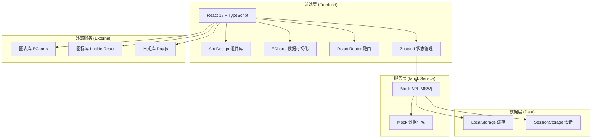

# 智慧港口与集装箱管理系统 - 技术架构文档

## 1. 架构设计



## 2. 技术描述

- **前端框架**: React@18 + TypeScript
- **构建工具**: Vite@5
- **UI 组件库**: Ant Design@5
- **样式方案**: TailwindCSS@3 + SCSS
- **状态管理**: Zustand@4
- **路由管理**: React Router@6
- **数据可视化**: ECharts@5
- **图表类型**: 折线图、柱状图、饼图、雷达图、热力图、甘特图
- **图标库**: Lucide React
- **日期处理**: Day.js
- **Mock服务**: MSW (Mock Service Worker)
- **代码规范**: ESLint + Prettier
- **类型检查**: TypeScript Strict Mode

## 3. 路由定义

| 路由路径 | 页面名称 | 所属模块 | 权限要求 |
|----------|----------|----------|----------|
| /login | 登录页 | 认证模块 | 公开 |
| / | 首页驾驶舱 | 首页模块 | 登录用户 |
| /vessel/list | 船舶列表 | 船舶调度 | 船公司/运营/管理员 |
| /vessel/forecast | 到港预报 | 船舶调度 | 船公司/运营 |
| /vessel/berth | 泊位计划 | 船舶调度 | 运营/管理员 |
| /container/gate-in | 集装箱进闸 | 集装箱管理 | 闸口/运营 |
| /container/yard | 堆场管理 | 集装箱管理 | 堆场/运营/管理员 |
| /container/tracking | 货物跟踪 | 货主服务 | 货主/运营 |
| /customs/declaration | 报关管理 | 货主服务 | 货主/运营 |
| /driver/appointment | 提箱预约 | 司机服务 | 司机/运营 |
| /finance/bill | 费用账单 | 费用管理 | 所有登录用户 |
| /finance/invoice | 发票管理 | 费用管理 | 货主/财务 |
| /claim/apply | 理赔申请 | 异常处理 | 货主/船公司 |
| /claim/approve | 理赔审批 | 异常处理 | 运营/法务/管理员 |
| /member/center | 会员中心 | 会员体系 | 货主/船公司 |
| /dashboard/operation | 运营看板 | 数据分析 | 运营/管理员 |
| /dashboard/prediction | 预测分析 | 数据分析 | 管理员 |
| /report/center | 报表中心 | 系统管理 | 运营/管理员 |
| /system/user | 用户管理 | 系统管理 | 管理员 |
| /system/config | 基础数据 | 系统管理 | 管理员 |

## 4. 数据模型定义

### 4.1 TypeScript 类型定义

```typescript
// 用户类型
interface User {
  id: string;
  username: string;
  role: 'shipping' | 'owner' | 'driver' | 'yard' | 'operation' | 'legal' | 'finance' | 'admin';
  name: string;
  company?: string;
  phone: string;
  email?: string;
  avatar?: string;
  memberLevel?: 'normal' | 'silver' | 'gold';
  annualThroughput?: number;
}

// 船舶类型
interface Vessel {
  id: string;
  name: string;
  imo: string;
  vesselType: string;
  length: number;
  width: number;
  draft: number;
  tonnage: number;
  teu: number;
  flag: string;
  companyId: string;
  companyName: string;
}

// 到港预报类型
interface VesselForecast {
  id: string;
  vesselId: string;
  vesselName: string;
  eta: Date;
  etd: Date;
  originPort: string;
  nextPort: string;
  cargoType: string;
  teuIn: number;
  teuOut: number;
  status: 'pending' | 'approved' | 'rejected' | 'arrived';
  recommendedBerth?: string;
  recommendedTime?: Date;
  createTime: Date;
}

// 泊位计划类型
interface BerthPlan {
  id: string;
  vesselId: string;
  vesselName: string;
  berthNo: string;
  berthTime: Date;
  departureTime: Date;
  status: 'scheduled' | 'berthed' | 'completed' | 'cancelled';
  operationType: string;
  craneAssigned: string[];
}

// 集装箱类型
interface Container {
  id: string;
  containerNo: string;
  size: '20GP' | '40GP' | '40HQ' | '45HQ';
  type: string;
  status: 'empty' | 'loaded' | 'damaged';
  location?: string;
  yardBlock?: string;
  yardSlot?: string;
  blNo?: string;
  cargoDesc?: string;
  weight?: number;
  inGateTime?: Date;
  outGateTime?: Date;
  vesselId?: string;
  vesselName?: string;
  ownerId?: string;
  ownerName?: string;
}

// 堆场类型
interface YardBlock {
  id: string;
  blockNo: string;
  area: string;
  totalSlots: number;
  usedSlots: number;
  maxTier: number;
  maxRow: number;
  maxBay: number;
  equipmentAssigned: string[];
}

// 运单类型
interface ShippingOrder {
  id: string;
  orderNo: string;
  blNo: string;
  containerNos: string[];
  shipper: string;
  consignee: string;
  notifyParty: string;
  pol: string;
  pod: string;
  etd: Date;
  eta: Date;
  cargoDesc: string;
  weight: number;
  teu: number;
  status: 'created' | 'in-transit' | 'arrived' | 'customs' | 'released' | 'delivered';
  estimatedReleaseTime?: Date;
}

// 报关单类型
interface CustomsDeclaration {
  id: string;
  orderId: string;
  orderNo: string;
  declarationNo?: string;
  shipper: string;
  consignee: string;
  cargoDesc: string;
  hsCode: string;
  value: number;
  currency: string;
  documents: CustomsDocument[];
  status: 'draft' | 'submitted' | 'verified' | 'customs-pending' | 'cleared' | 'rejected';
  customsBroker?: string;
  submitTime?: Date;
  clearTime?: Date;
  remarks?: string;
}

// 提箱预约类型
interface PickupAppointment {
  id: string;
  appointmentNo: string;
  driverId: string;
  driverName: string;
  plateNo: string;
  containerNo: string;
  orderNo: string;
  appointmentDate: Date;
  timeSlot: string;
  recommendedSlot?: string;
  status: 'pending' | 'confirmed' | 'completed' | 'cancelled' | 'no-show';
  checkInTime?: Date;
  checkOutTime?: Date;
  penaltyAmount?: number;
}

// 费用账单类型
interface Bill {
  id: string;
  billNo: string;
  customerId: string;
  customerName: string;
  period: string;
  items: BillItem[];
  totalAmount: number;
  paidAmount: number;
  status: 'unpaid' | 'partial' | 'paid' | 'overdue';
  dueDate: Date;
  createTime: Date;
  paidTime?: Date;
}

interface BillItem {
  id: string;
  itemType: 'loading' | 'unloading' | 'storage' | 'port-fee' | 'customs-fee' | 'other';
  itemName: string;
  quantity: number;
  unit: string;
  unitPrice: number;
  amount: number;
  relatedContainer?: string;
  relatedVessel?: string;
  operationDate?: Date;
}

// 理赔工单类型
interface Claim {
  id: string;
  claimNo: string;
  applicantId: string;
  applicantName: string;
  applicantType: 'owner' | 'shipping' | 'driver';
  containerNo?: string;
  orderNo?: string;
  claimType: 'damage' | 'loss' | 'delay' | 'other';
  description: string;
  evidenceUrls: string[];
  claimAmount: number;
  status: 'pending' | 'reviewing' | 'approved' | 'rejected' | 'paid';
  currentApprover?: string;
  approvalHistory: ApprovalRecord[];
  paidAmount?: number;
  paidTime?: Date;
  createTime: Date;
}

interface ApprovalRecord {
  id: string;
  approverId: string;
  approverName: string;
  approverRole: string;
  action: 'approve' | 'reject' | 'transfer';
  comments: string;
  approveTime: Date;
}

// 会员等级类型
interface MemberLevel {
  level: 'normal' | 'silver' | 'gold';
  name: string;
  minThroughput: number;
  benefits: MemberBenefit[];
}

interface MemberBenefit {
  id: string;
  name: string;
  description: string;
  type: 'priority' | 'discount' | 'extended' | 'service';
  value: number;
  unit: string;
}

// 统计数据类型
interface DashboardStats {
  berthUtilization: number[];
  gatePassRate: number[];
  yardSaturation: number;
  operationEfficiency: number;
  complaintRate: number;
  dailyThroughput: DailyThroughput[];
  vesselCalls: number;
  containerHandled: number;
  revenue: number;
}

interface DailyThroughput {
  date: string;
  teuIn: number;
  teuOut: number;
  total: number;
}
```

## 5. 项目目录结构

```
src/
├── assets/              # 静态资源
│   ├── images/
│   └── styles/
├── components/          # 公共组件
│   ├── layout/         # 布局组件
│   ├── charts/         # 图表组件
│   ├── common/         # 通用组件
│   └── business/       # 业务组件
├── pages/              # 页面组件
│   ├── auth/           # 认证模块
│   ├── dashboard/      # 驾驶舱/看板
│   ├── vessel/         # 船舶调度
│   ├── container/      # 集装箱管理
│   ├── customs/        # 报关管理
│   ├── driver/         # 司机服务
│   ├── finance/        # 费用管理
│   ├── claim/          # 理赔管理
│   ├── member/         # 会员体系
│   └── system/         # 系统管理
├── store/              # 状态管理
│   ├── useUserStore.ts
│   ├── useAppStore.ts
│   └── index.ts
├── services/           # API 服务
│   ├── request.ts      # 请求封装
│   ├── mock/           # Mock 数据
│   ├── auth.ts
│   ├── vessel.ts
│   ├── container.ts
│   └── ...
├── types/              # TypeScript 类型定义
│   ├── index.ts
│   ├── api.ts
│   └── models.ts
├── utils/              # 工具函数
│   ├── format.ts
│   ├── validate.ts
│   └── storage.ts
├── hooks/              # 自定义 Hooks
│   ├── useAuth.ts
│   ├── useDashboard.ts
│   └── ...
├── router/             # 路由配置
│   └── index.tsx
├── App.tsx
└── main.tsx
```

## 6. 核心技术方案

### 6.1 状态管理方案
- 使用 Zustand 进行全局状态管理
- 按模块划分 Store：用户、应用、业务数据
- 持久化关键状态到 LocalStorage
- 支持状态选择器优化重渲染

### 6.2 数据可视化方案
- 使用 ECharts 5 作为图表库
- 封装通用图表组件：折线图、柱状图、饼图、雷达图
- 自定义主题配色，与UI风格统一
- 支持响应式自适应和数据下钻

### 6.3 权限控制方案
- 基于角色的访问控制 (RBAC)
- 路由级权限：登录时根据角色过滤可访问路由
- 组件级权限：自定义权限指令控制按钮/组件显示
- 接口级权限：请求时携带Token，后端校验

### 6.4 Mock 数据方案
- 使用 MSW (Mock Service Worker) 模拟后端接口
- 按模块组织 Mock 处理器
- 使用 Faker 生成真实感测试数据
- 支持真实接口与 Mock 接口切换
